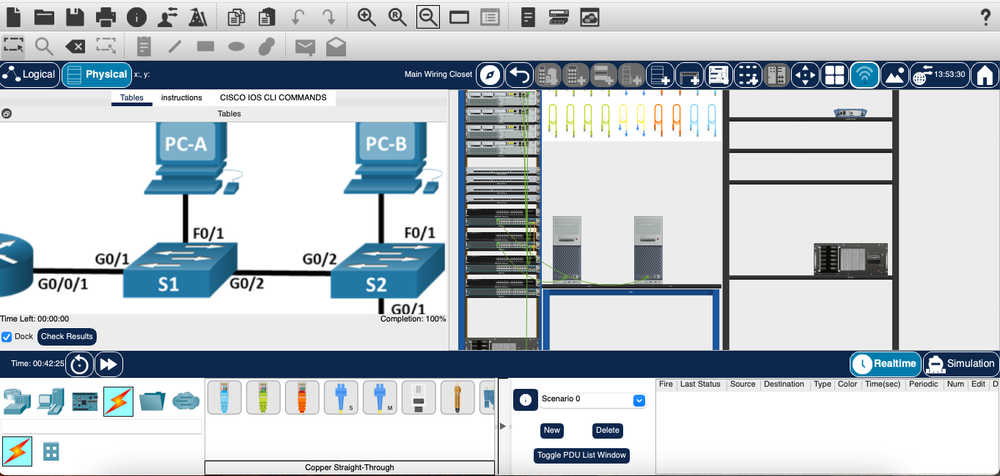
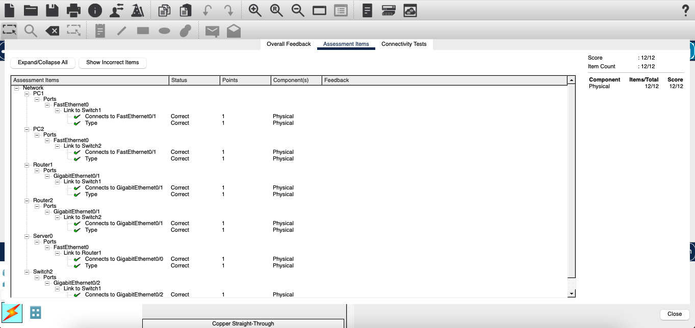
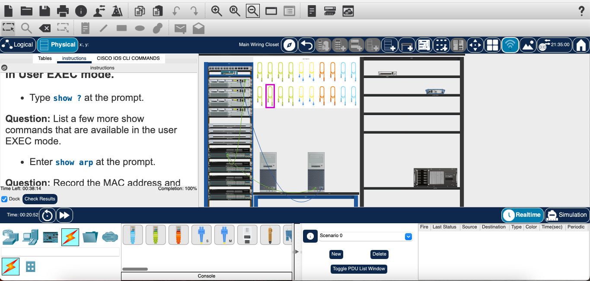
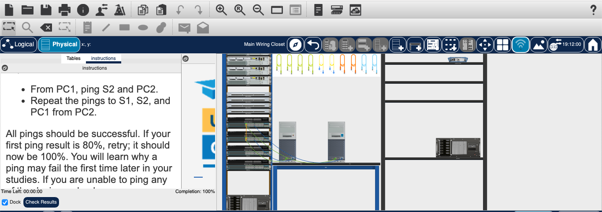
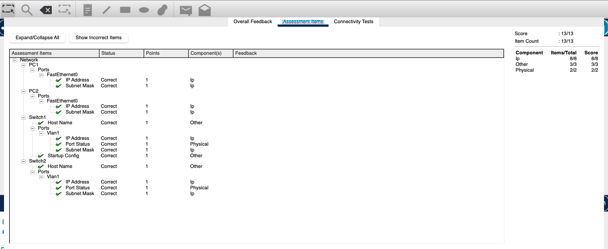
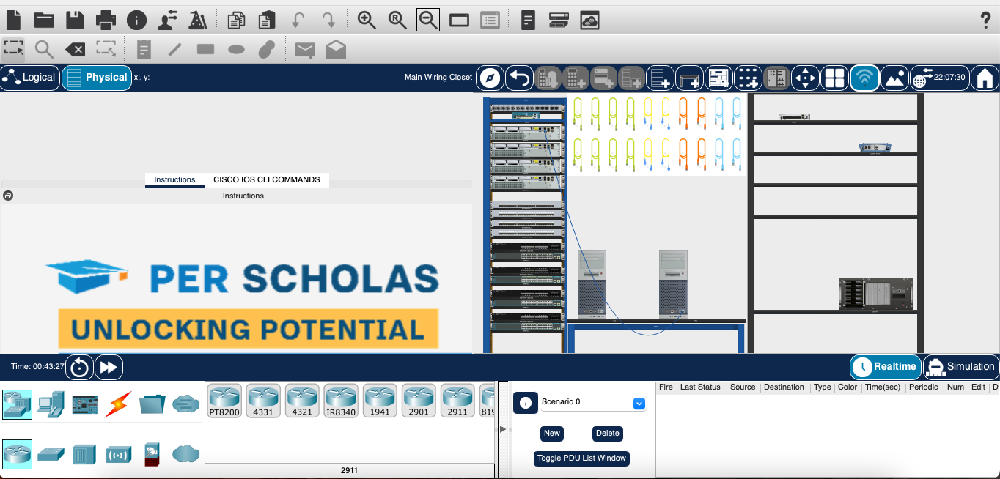
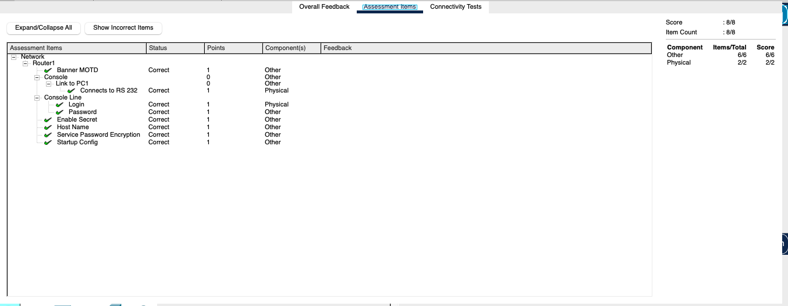
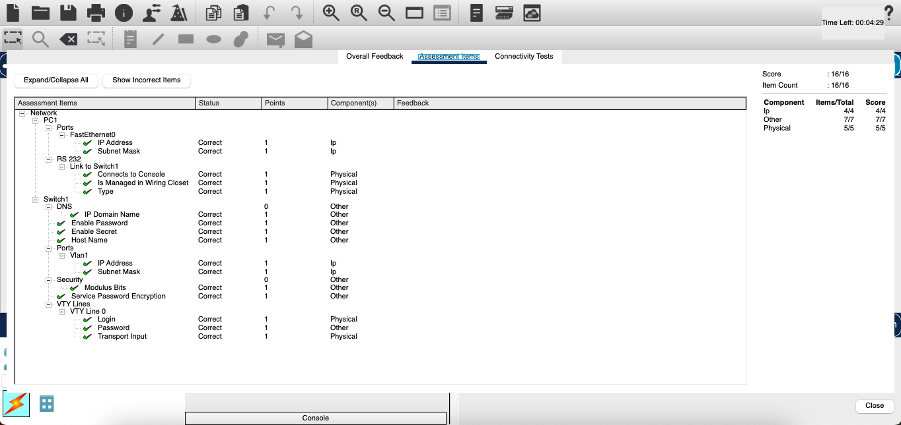
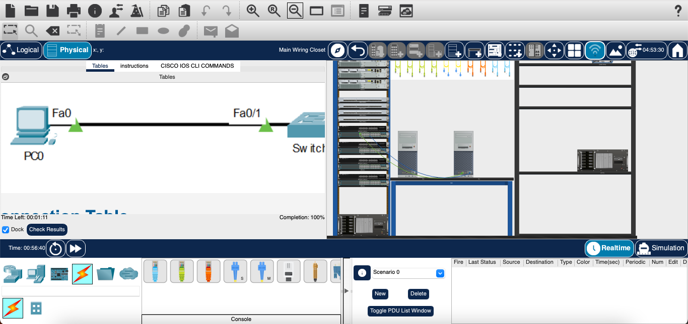

# Networking Labs (Cisco Packet Tracer)

## Overview
This project demonstrates hands-on networking experience using Cisco Packet Tracer. It includes configuring routers and switches, implementing VLANs, enabling secure remote access, and building network topologies.

---

## Labs Completed

### PS00 – Connect Network Diagram
- Connected devices based on a provided network diagram
- Verified connectivity between hosts using basic testing

---

### PS01 – Cisco IOS Show Commands
- Used Cisco IOS show commands to inspect device configurations
- Verified interface status and network information

---

### PS02 – Basic Connectivity (Switch)
- Configured switch ports for network connectivity
- Tested communication between devices using ping

---

### PS03 – Router Settings
- Configured router interfaces with IP addressing
- Verified routing between connected networks

---

### PS04 – SSH Configuration
- Enabled SSH for secure remote access to network devices
- Configured authentication and remote login settings

---

### PS05 – VLAN & Trunk
- Created VLANs and assigned switch ports
- Configured trunk links for inter-switch communication

---

### PS06 – Build Network
- Built a complete network using routers and switches
- Verified communication across multiple devices

---

### PS07 – Router-on-a-Stick
- Configured subinterfaces for inter-VLAN routing
- Enabled communication between VLANs using a router

---

### PS08 – Layer 3 Switching
- Configured Layer 3 switch for inter-VLAN routing
- Improved network efficiency and scalability

---

## Tools & Technologies
- Cisco Packet Tracer  
- Cisco IOS (CLI)  
- Routing & Switching  
- VLANs & Trunking  
- SSH Configuration  

---

## Key Skills Gained
- Network configuration and troubleshooting  
- Router and switch management  
- VLAN segmentation and inter-VLAN routing  
- Secure remote access (SSH)  
- Network topology design  
